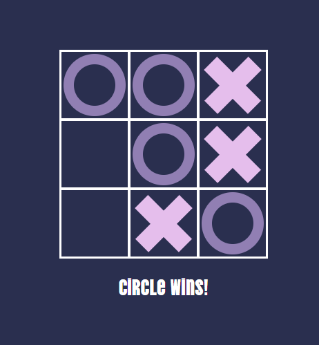

# Tic Tac Toe React

A simple project of the game tic tac toe in React js.

  0

## Available Scripts

In the project directory, you can run:
### `npm start`
Runs the app in the development mode.\
Open [http://localhost:3000](http://localhost:3000) to view it in your browser.

